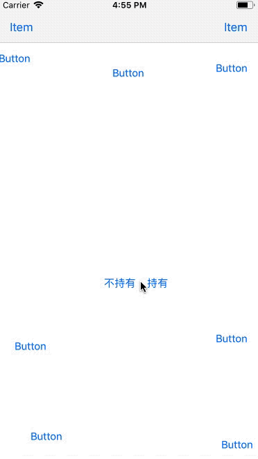

# Popover



## Requirements

- iOS 8.0+
- Swift 4

## Installation

### Carthage

You can use [Carthage](https://github.com/Carthage/Carthage) to install `Popover` by adding it to your `Cartfile`:
```
github "cbahai/Popover"
```
Or

```
git "ssh://gitlab/fengyonghai/Popover.git"
```

## Usage

```swift
import Popover
```

```swift
func buttonClick(_ sender: UIButton, forEvent event: UIEvent) {
    let viewControllerContent = UIViewController()
    viewControllerContent.view.frame = CGRect(x: 0, y: 0, width: 200, height: 200)

    let pvc = PopoverViewController()
    pvc.trigger = sender/*or event*/
    pvc.content = viewControllerContent
    pvc.show(in: self)
}
```
Or

```swift
func barButtonItemClick(_ sender: UIBarButtonItem, forEvent event: UIEvent) {
    let viewContent = UIView(frame: CGRect(x: 0, y: 0, width: 200, height: 200))

    let pvc = PopoverViewController()
    pvc.trigger = event
    pvc.content = viewContent
    pvc.show(in: self)
}
```
